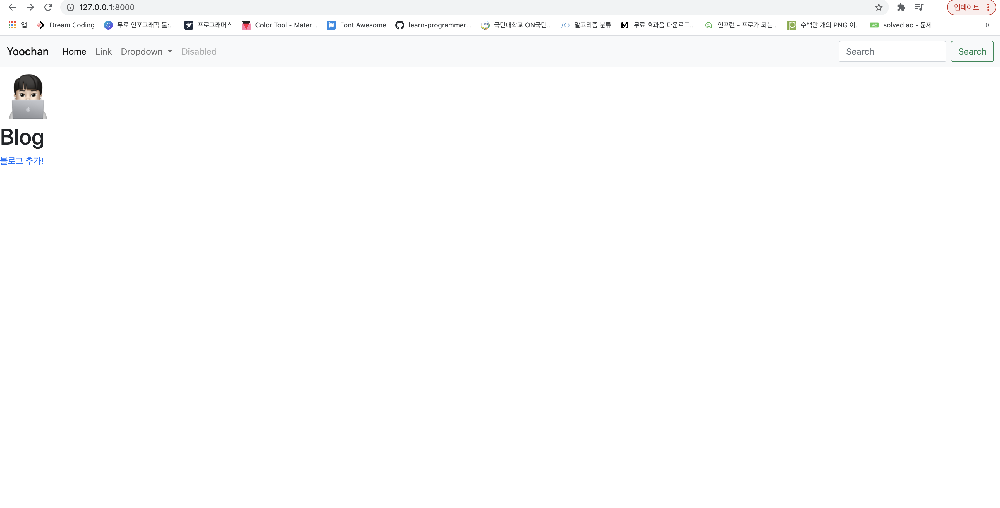
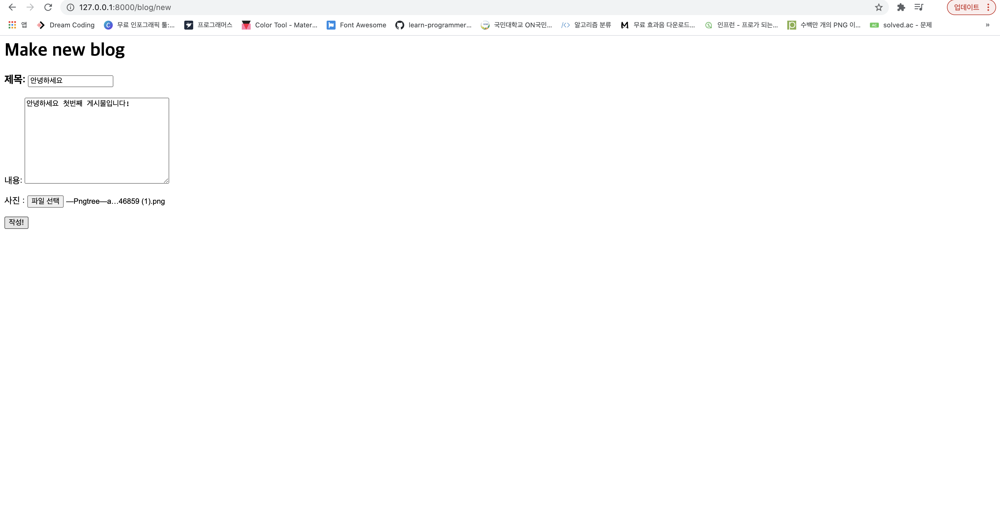
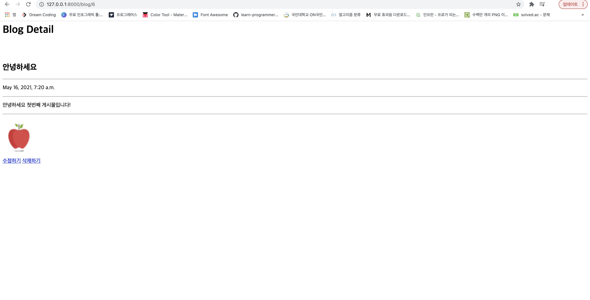
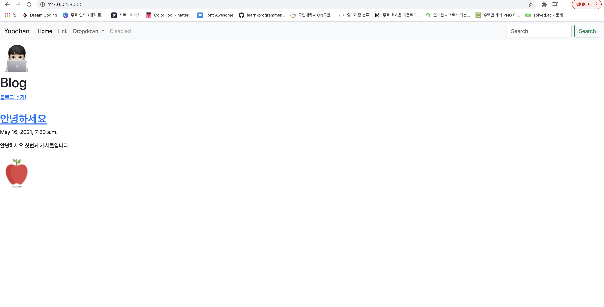
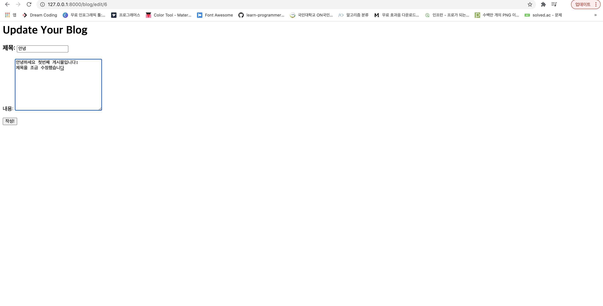
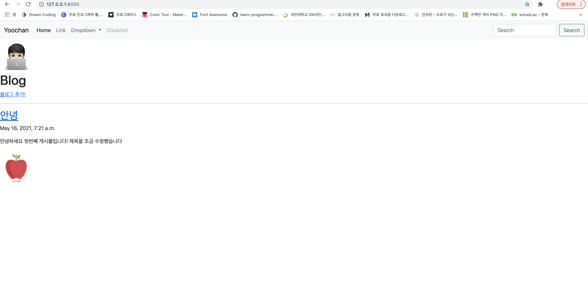
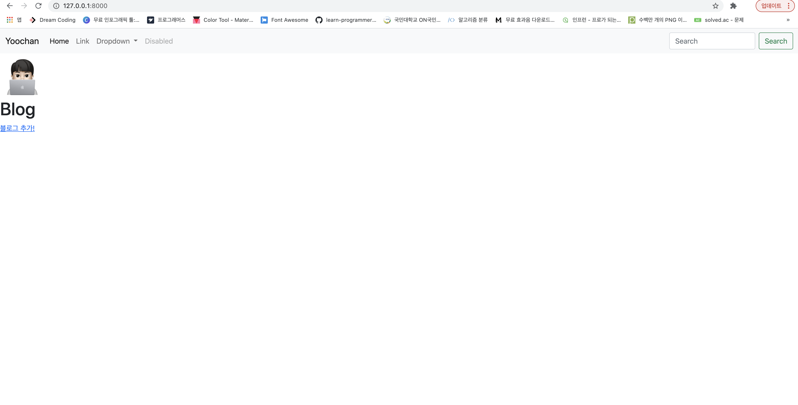

# 첫 화면

- 블로그가 아직 생성되지 않은 첫 화면입니다. 블로그 추가 버튼을 눌러 블로그를 추가할 수 있는 상태입니다.

# 블로그 추가

- 새로운 블로그를 만드는 화면입니다. 

# 블로그 확인

- 새로운 블로그의 detail 페이지입니다.

- 새로운 블로그가 성공적으로 추가된 home 화면입니다.

## 블로그 수정

- detail 페이지에서 수정하기 버튼을 눌렀을 때의 화면입니다.

- 다음과 같이 수정사항이 잘 반영된 것을 확인할 수 있습니다.

### 블로그 삭제

- detail 페이지 내에서 삭제하기 버튼을 눌렀을 때 다음과 같이 정상적으로 블로그가 삭제된 것을 확인할 수 있습니다.
  
